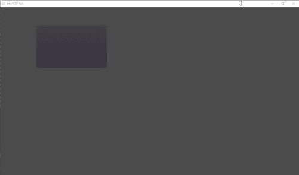

# tm170514ch

**조금씩 진행중입니다.** 아직 안 끝났어요  
**in progress**. not finished yet

고도 엔진으로 탄막슈팅(2D) 을 만드려고 시도하는 중인 저장소입니다.  
trial practice to create bullet-hell game (2D) in Godot Engine.

Godot v2.1.3

## 면책조항 Disclaimer

고도엔진을 배우기 시작할 즈음에 시작한 물건이고, 어떻게든 만들어보려고 시도하는 결과물이라 여기저기 들쑤신 코드들도 많고 코드가 깔끔하지 않습니다. 이것보다 훨씬 깔끔한 구조가 가능할 것입니다.  
Codes are not clean; because It's practice and started when early time of learning Godot engine.

## 참조한 프로젝트(들) referenced projects

- [Bullet-hell onslaught](https://github.com/lydianchord/bullet-hell-onslaught)
- [Bullet Shower Demo](https://github.com/godotengine/godot-demo-projects/tree/2.1/2d/shower_of_bullets)
  - [수정한 버전 Modified version](https://github.com/pliTri/mod_shower_of_bullets) - 스프라이트 회전 지원 supports rotation of sprite
- 슈팅게임 언어 (STGL)의 컨셉 / concepts of [STGL language](http://abagames.sakura.ne.jp/stgl/)

## 라이센스 License

### 코드 code

MIT or WTFPL 2 (choose what you want)  
걍 갖다 쓰세요 (코드만 적용)

### 콘텐츠 contents (image, music, etc)

CC-BY